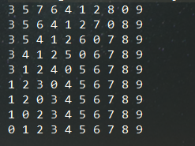

#冒泡排序
最差时间复杂度为 **O(n^2)**  
平均时间复杂度为 **O(n^2)**  
稳定度为 **稳定** (两个相同值的相对位置在排序前后保持一致)  
空间复杂度为 **O(1)**

优化后的算法解决了已经排序但是仍然会进行没用的循环比较的问题，但是时间复杂度仍然为**O(n^2)**

*特点:* 适合数据规模很小的时候使用，算法简单但是效率不高，并不实用，因此在实际使用中比较少  

*思路:* 将n个数进行n-1次循环，从第一个数开始，每次都跟后一个数进行比较，若大于则交换位置，一直到
将最大的数交换到最后一个位置上

原始数据为:{8,3,5,7,6,4,1,2,9,0} 
 
数据运行结果:  

