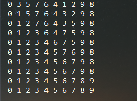

#选择排序
最差时间复杂度为 **O(n^2)**  
平均时间复杂度为 **O(n^2)**  
稳定度为 **稳定** (两个相同值的相对位置在排序前后保持一致)  
空间复杂度为 **O(1)**

*特点:* 相同循环次数下，交换次数比冒泡排序少，因而适用于关键字信息量较大、占用空间大的记录。

*思路:* 从第一个数开始，依次与后面的数进行比较，通过比较，找到数组中的最小或者最大的数，将其
放在数组的开头

原始数据为:{8,3,5,7,6,4,1,2,9,0} 
 
数据运行结果:   
