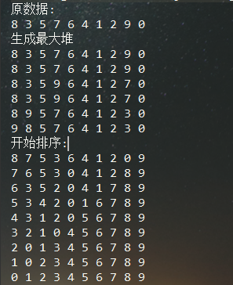

# 堆排序

最差时间复杂度为 **O(nlogn)**  
平均时间复杂度为 **O(nlogn)**  
稳定度为 **不稳定** (两个相同值的相对位置在排序前后保持一致)  
空间复杂度为 **O(1)**

## 特点
 堆是一种数据结构，可以简单的看成一颗完全二叉树，当每个父节点都自身的子节点小时，称为
 最小堆，反之，当节点比子节点大时，称为最大堆。 
    
 可以使用数组实现堆，这样查询会比较快，而且堆是完全二叉树，所以不会浪费空间。我们查询
 的节点下标为i时（从0开始存储数组），左子节点的下标为**i*2+1**,右子节点的下标为**i*2+2**
 _（如果从1开始存储，则为i*2和i*2+1）_  
   
 堆排序与原数组的排序状态无关，因此性能上比选择、插入、冒泡等要好
 
## 思路
当给定一个数组的时候，需要先用这个数组创建一个最大堆，既然是最大堆，那么堆顶的数就是整个
数组的最大数，然后进入循环，我们将堆顶的数与堆的最后一个数交换，然后去掉最后一个数，再将
剩下的数创建成一个最大堆。如此循环，当堆只剩最后一个数时，这个数也就是最小的数了，排序就
此完成了。

## 原始数据为
 {8,3,5,7,6,4,1,2,9,0} 
 
## 运行结果

