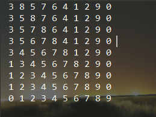

# 插入排序

最差时间复杂度为 **O(n^2)**  
平均时间复杂度为 **O(n^2)**  
稳定度为 **稳定** (两个相同值的相对位置在排序前后保持一致)  
空间复杂度为 **O(1)**

## 特点
算法主要花费时间在赋值上，最坏情况下，即逆序情况下，每次都需要进行赋值到最开始的值上

## 思路
假设数组中的前半部分为有序部分，后半部分为无序部分，遍历后半部分，将后半部分的数字插入到
前半部分中。

## 希尔排序
### 思路
当数组为逆序时，那么每次都需要赋值大量的数值，为此对排序方法进行改进。使用一个增量，比如一开始的取半
跳过某些数值之后进行排序。

### 解析
 以{8,3,5,7,6,4,1,2,9,0}为例子
 当增量为5时，遍历数组取出{8,4},{3,1},{5,2}...等等，然后对小括号里的数进行直接插入排序，
 后续增量为5/2=2时，取出{4,2,0,3,9}(此时8和4的位置颠倒了，所以首位置为4...
 重复以上操作，当增量为1时，实际上就是进行一次直接插入排序即可

## 原始数据为
 {8,3,5,7,6,4,1,2,9,0}  
## 数据运行结果   

