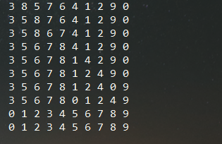

# 归并排序

最差时间复杂度为 **O(nlogn)**  
平均时间复杂度为 **O(nlogn)**  
稳定度为 **稳定** (两个相同值的相对位置在排序前后保持一致)  
空间复杂度为 **O(n)**  
每次递归调用函数都会申请一个数组的空间，但是调用完之后会被回收，因此只申请了n个空间

## 特点
采用分治法，将已经有序的字序列合并成一个大的有序序列。相当于将一个大的问题分解成了许
多的子问题，每个子问题都要求自身的有序的，再把子问题细分，这样递归下去一直到序列中只
有一个数，默认有序，在进行合并，则完成排序

## 思路
归并算法的核心主要是如何将两个有序的子序列合并在一起。我们借助一个空的数组，然后对原
数组的两个子序列进行遍历，逐个进行比较，小的数放进空数组中，然后再把这一段合并后的序列
赋值给原数组，则完成排序。  
核心已经讲完，剩下的就是递归了，我们使用取头尾的中间值，将序列分成两个部分，然后进行递归，
递归结束后进入合并算法，问题解决。

### 优化
在使用递归的算法中（如快排），在数据量比较小的时候，排序的速率并没有插入排序快，因此可以
在某个量级的时候，不进行递归，采用插入排序算法  
当递归完之后需要进行合并的时候，如果此时序列已经是有序了，也就是左子序列的最大值小于右
子序列的最小值时，可以不用进行合并，少去多余步骤

## 原始数据为
 {8,3,5,7,6,4,1,2,9,0} 

## 运行结果
