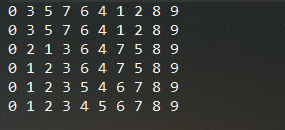

# 快速排序

最差时间复杂度为 **O(n^2)**  
平均时间复杂度为 **O(nlogn)**  
稳定度为 **不稳定** (两个相同值的相对位置在排序前后保持一致)  
空间复杂度为 **O(logn)-O(n)**  
空间复杂度解析: 快排递归使用方法栈存储关键数值，使用的栈空间与递归的深度有关，最少递归logn次，最多
可递归n-1次，因此为O(logn)-O(n)

## 特点
快速排序算法是对冒泡算法的一种改进算法，与其他算法相比较，快速算法不浪费空间，并且排序
速度快，是比较优先适用于大量数据的排序算法。

## 思路
使用基准值法，先确定一个基准值，然后用这个基准值将数组分成两个部分。意思就是先确定基准值，然后
遍历数组，比基准值大的在基准值右边，比基准值小的排在基准值左边，然后分别对左边的数组和右边的数
组进行递归。  
在不优化前，如果基准值不能很好地将数组分成了两个部分，那么快排的效率是比较低的，甚至退化成为冒泡
排序算法  

### 优化
使用三值取中法进行优化，取头尾和头尾中间的数进行比较，取出中间值作为基准值参与运算。这样可以解决
基准值不能将数组分成两部分的隐患，但是对于整个数组都是相等值的情况，并没有什么办法  
当数组量比较小时，可以使用插入排序代替快速排序的递归操作，在数据量小的时候快排并没有什么优势

## 原始数据
{8,3,5,7,6,4,1,2,9,0} 

## 运行结果
